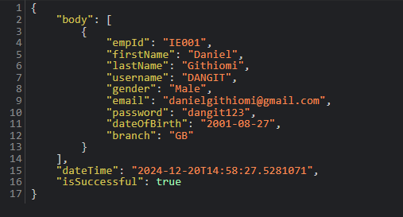

#  VOUCHER SCAN

> Developed by <a href="http://github.com/githiomi">Daniel Githiomi</a>

## Application Description

This is a REST API built using Java Spring Boot. It acts as a bridge between an Android mobile application and a PostgreSQL database, enabling secure access to user data and voucher redemption functionality. The API is designed to handle user authentication and the process of redeeming vouchers scanned by the mobile application.

## Preview

Below is a preview of the API **user's** response:

## Authentication

The API requires that the Android application sends valid credentials for authentication. The authentication process uses token-based authentication (JWT) to verify users and manage session states.

### Example of valid credentials:

The application was developed with the user of **Spring Security** and therefore requires authentication.

| Username | Password   |
|----------|------------|
| user     | [password] |

**PASSWORD** will be found in the terminal when the application is started

## MINIMUM SYSTEM REQUIREMENTS

* Pre-installed Java JDK
* 4GB RAM or Higher

## COMPATIBILITY

This API is designed to be compatible with Android mobile applications that interact with the following endpoints:

- `/api/v1/users`: For user authentication and management.
- `/api/v1/vouchers`: For redeeming scanned vouchers.

The mobile application should be able to interact with these endpoints to retrieve data and execute operations.

## TECHNOLOGIES USED

This API is built using the following technologies:

* **Java 21**
* **Spring Boot 2.7.x**
* **Spring Security** for authentication and authorization
* **PostgreSQL** for database management
* **BCrypt** for password hashing
* **Maven** for dependency management
* **Lombok** for boilerplate code reduction

## KNOWN BUGS

No bugs to report at the moment! The API is fully functional and performs as expected.

__Slow database connection or network latency may impact response times during high traffic periods.__

## SETUP INSTRUCTIONS

To set up and run this project locally, follow these steps:

1. **Clone the repository**:
   Git clone [this](https://www.github.com/githiomi/VoucherScan) into your terminal.
2. **Open the folder**:
   Open the folder in your favourite editor, for example Intellij.
3. **Setup**:
   Run the application and check the terminal for the **Spring Security Password**
4. **Enjoy**:
   Use the __Voucher Scan__ REST API.

## SUPPORT AND CONTACT INFORMATION

Contact me through any of the following channels:

* Slack: danielgithiomi
* GitHub: githiomi
* LinkedIn: [danielgithiomi](https://linkedin.com/in/daniel-githiomi/)
* Email: <danielgithiomi@gmail.com>

## LICENSES

Click the following to access my license page: [Click-Here](https://githiomi.github.io/Privacy-Policy/)

> Copyright (c) {2024} DhosioLux.
